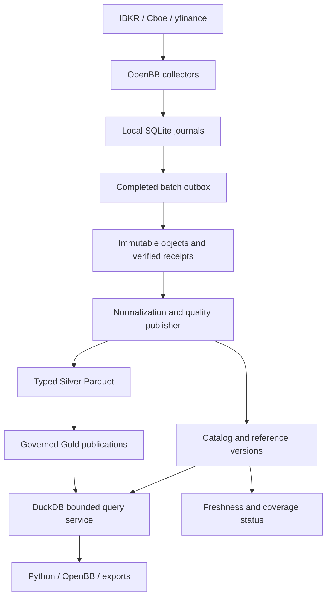

# Market-data database design

Status: the initial local implementation is deployed as of 2026-09-09. See the data-platform source `docs/market-store.md` and the application report `reports/market-store-20260909T155113Z/README.md` for installed behavior and validation. The sections below retain the design rationale; PostgreSQL, Iceberg and a remote SFTP target remain optional deployment work.

Use immutable files for original evidence, typed Parquet tables for market history, DuckDB for analytical reads, and the existing catalog abstraction for transactional publication and reference data. Retain per-collector SQLite journals for recovery.

## Scope and evidence

The inspected central archive is `/home/zdqclawbot/work/app/dq-quant-invest-data`; collectors run under `/home/zdqclawbot/work/app/openbb/collectors`. These are deployment paths, not constants for new adapters. Reuse the existing configurable data root.

The catalog names 12 datasets: Cboe SPX/SPXW chains; IBKR SOFR, index, equity and selected-option quotes; yfinance share-class quotes; IBKR SOFR, option, equity and index one-minute bars; and yfinance share-class and Dow one-minute bars. Full Cboe chains and the selected IBKR option universe are distinct products. Coverage is incomplete for some collections.

The archive README records 2.74 GB, 16,578 objects and 113 committed deliveries at its 2026-09-09 verification. This is a historical baseline, not a fresh inventory. One previously validated SPX capture contained 28,444 contracts and 56 expirations.

The pre-implementation delivery waited for session completion/interruption; installed incremental delivery now also publishes completed batches during open sessions. A receipt proves transfer integrity, not complete market coverage or usable prices. Active collector data can be newer. The platform already has generic DuckDB catalog tables, canonical market bars, an optional PostgreSQL `data_platform` schema and optional Iceberg support. Extend those boundaries.

## Physical storage

| Component | Storage | Purpose | Writer/access rule |
| --- | --- | --- | --- |
| Collector recovery | Existing per-collector SQLite WAL | Polls, checkpoints, pending exports and deliveries | Collector owns writes on local disk |
| Original evidence | Existing content-addressed files and receipts | Raw payloads, exported observations, attempts, quarantine, reference generations | Immutable objects verified before receipt commit |
| Central catalog | Existing catalog backend; PostgreSQL for shared deployment | Identities, publications, file membership, quality, reference versions and watermarks | Transactional publisher; read-only consumers through service |
| Market history | Versioned Silver/Gold Parquet | Quote observations, option-chain captures and bar revisions | Immutable generations, one central publisher initially |
| Analytical execution | DuckDB | Bounded SQL over a pinned file set; disposable caches | Per-query/process readers; no shared writable database file |

First rollout: serialize all catalog connections and mutations with shared process locks. The API and local SDK/CLI use the same ownership protocol and close their connection before releasing the lock. Remote consumers query the service; direct uncoordinated DuckDB access is unsupported. Use one authoritative metadata backend, without dual-writing PostgreSQL and DuckDB.

PostgreSQL is the recommended shared central deployment when independently running publishers and clients need concurrent catalog transactions. It remains an optional dependency, consistent with the existing platform. Parquet stays the authoritative typed history in either mode.

DuckDB supports column/filter pushdown into Parquet; PostgreSQL MVCC supports concurrent catalog users. Embedded DuckDB file concurrency and SQLite WAL locality require explicit ownership. Official documentation is linked below. The current scale alone does not justify another time-series database. Evaluate existing optional Iceberg support when remote table access, independent writers or maintenance requirements warrant it, using measured workloads.



## Catalog and reference schema

These are logical contracts. The implementation combines capture/revision rows in one table and uses `archive_clock`, heartbeat, source-record and publication tables for watermarks; inspect `data/market/schema.py` for physical names. Parquet logical primary/foreign keys are enforced by publication checks. Extend existing `dataset`, `dataset_version`, `dataset_snapshot`, `dataset_partition`, `ingestion_run`, `lineage_edge` and `quality_result` concepts. A dataset snapshot is a publication/version; call one market observation batch a `capture_id` to distinguish them.

| Relation | Key and principal fields | Constraint / index |
| --- | --- | --- |
| `raw_object` | SHA256 PK, storage key, bytes, media type, first_verified_at | Hash/size verified; paths resolved server-side |
| `delivery` | (collector_id, manifest_hash) PK, engine, session_id, optional batch_id, verified_at, version | Matching receipt and manifest identity/counts |
| `delivery_object` | (delivery key, object_hash, role, original_path) PK | Object may belong to many deliveries |
| `instrument` | instrument_uid PK, asset_class, identity namespace | Display ticker is not an identity |
| `instrument_version` | (instrument_uid, version_id) PK; economic terms, effective_from/to, known_at, evidence hash | Preserve changes and unknown terms |
| `provider_instrument_mapping` | mapping_id PK, provider key, instrument_uid, valid_from/to, known_at, reference_generation | IBKR conId and Cboe symbol use separate namespaces; ambiguity stays unresolved |
| `universe_membership` | (universe_id, generation_id, instrument_uid) PK, effective_from/to, known_at | Retain removed constituents |
| `capture` | capture_id PK, dataset, provider, collector/session/poll/attempt IDs, underlying_uid, observed_at, source_time, universe_generation, completeness states | Latest index: dataset/provider/underlying/observed_at |
| `capture_revision` | (capture_id, revision_id) PK, normalization version, row accounting, member_set_hash, quality_status | Exact set of observation revisions, no implicit union with earlier captures |
| `publication` | Existing dataset snapshot ID, schema/transform/config hashes, membership_manifest_hash, committed_at, predecessor, quality_status | Atomic current pointer per dataset; retain history |
| `publication_file` | (publication_id, file_hash) PK, table, partition, rows, time/instrument bounds | Exact immutable file list |
| `capture_publication` | (capture_id, revision_id, publication_id) PK, first_published_at | Locate all parts and original eligibility time |
| `observation_delivery` | (observation_uid, delivery key) logical PK | Many-to-many provenance; large bridge may reside in Parquet |
| `collection_watermark` | (dataset, provider, scope) PK, collected/archived/published markers, heartbeat, oldest_pending_at | Latest collected requires collector status, not inference from archive |

Use stable opaque instrument IDs, UTC knowledge timestamps and half-open effective intervals `[from,to)`. Reference facts include currency, exchange/venue, multiplier, tick size and calendar. Options additionally need underlying, trading class, right, strike, expiry, last trading time and settlement convention. Keep SPX and SPXW contract economics distinct; do not infer unknown AM/PM settlement or multiplier solely from symbol root.

SOFR contracts require qualified contract identities: several can share the provider display symbol `SOFR3`. Store contract month, expiry, last trading time and accrual-period terms as versioned reference data where known. Continuous futures rolls and fitted curves are separate derived datasets.

## Typed market tables

| Table | Row grain / logical uniqueness | Payload and normal access |
| --- | --- | --- |
| `silver.option_chain_observation` | One contract in one capture revision; unique (capture_id, capture_revision_id, resolved instrument_uid) | Expiry, strike, call/put, trading class, bid/ask/last trade, sizes, OI, volume, provider IV/Greeks, underlying price and timestamps; full chain or expiry slice |
| `silver.quote_observation` | One instrument in one source poll attempt/revision; original observation UID unique | Bid/ask/last, sizes, volume, timestamps, optional Greeks; SOFR/equity/index/selected options identified by dataset |
| `silver.bar_revision` | One revision of one source bar business key | Start/end, frequency, OHLCV, optional VWAP/count, what_to_show, session scope, adjustment and revision |
| `silver.collection_attempt` | One source request attempt | Poll/chunk/attempt key, outcome, classified error, row accounting, requested scope; retain zero-row/timeouts |
| `gold.option_chain_capture` | Eligible published capture revision and its accepted rows | Source-specific chain with quality/coverage metadata |
| `gold.market_quotes` | Eligible source quote revisions | Explicit source identity; no implicit substitution |
| `gold.market_bars` | Eligible bar revisions | Complete revision history; latest/as-of are query policies |

Bar business key: `(instrument_uid, source/provider, bar_start, frequency, what_to_show, session_scope, adjustment_basis, currency, volume_unit)` under a versioned contract. Contract/unit migrations explicitly link predecessor keys. TRADES and MIDPOINT, regular and extended sessions, adjusted and unadjusted data cannot overwrite each other. Corrections append revisions; an unchanged re-fetch adds arrival lineage rather than another revision.

Shared fact columns, directly or through lossless referenced dimensions:

- Stable central observation UID based on collector namespace and original record ID; preserve collector record ID verbatim. Identical ID with different content is a conflict.
- Business key, source revision, revision basis, content hash, schema/normalization/mapping versions. Historical integer revision and live content-hash revision are different types; hashes have no chronological ordering.
- Dataset, provider/configured source, instrument UID, source symbol, optional conId, collector/session/poll/capture IDs.
- Nullable event_time; original source timestamp/timezone/semantics; collector_observed_at; nullable source_available_at; central_verified_at; first_published_at. UTC microsecond instants, with finer source precision preserved verbatim if encountered.
- Currency, price/size/volume units and basis, adjustment, requested/actual feed type, entitlement reference, quality flags.
- Raw object hash, original row locator/member key, values hash and delivery lineage, sufficient to trace each output to evidence.

Define canonical encoding, null representation, precision and timezone rules for identities. Do not recompute a stable record ID when a symbol mapping changes. Keep transport deduplication distinct from economic identity.

Implemented types: DECIMAL(38,18) price/strike and DECIMAL(28,8) size/volume. Source profiling found valid Yahoo prices exceed the initial DECIMAL(24,10) candidate; schema market-v2 preserves them exactly. Precision loss or overflow fails mapping or requires a schema change; never silently round. Provider IV/Greeks may use DOUBLE with non-finite values flagged. Preserve units: fractional versus percentage IV, vega/theta/rho scaling, contracts versus shares and provider-defined volume. Keep valid zeros and nulls distinct; raw source values remain available.

Gold follows existing fail-closed publication rules. Critical mapping failures, unresolved identities or active blocking quarantine prevent the affected candidate from promotion. Rebuild a separately scoped candidate and reassess if appropriate; do not disguise it as a complete original chain. Silver diagnostic access explicitly exposes its source/quality state.

## Capture integrity and SOFR baskets

A Cboe capture represents one delimited response attempt, linked to the existing poll and raw payload. A retry with changed prices is a different response attempt. Do not assume every row in every provider response shares the same receipt timestamp.

Record four separate states: transport completeness (all declared parts verified); response accounting (all returned rows accepted/duplicate/rejected); universe coverage (known covered universe or unknown); market quality (missing/crossed/stale/one-sided quotes). Full delivery of 28,444 rows does not prove full exchange-universe coverage. The existing loader's record uniqueness and single-poll selection checks are narrower than that claim.

A complete-chain request fails a row limit rather than silently truncating. Choose capture before expiry/strike/side filters. Never collect the latest price for each contract from different polls to manufacture a chain.

SOFR quotes are a basket across asynchronously polled contracts. Store `(basket_id, instrument_uid, observation_uid)` membership plus universe generation, requested/observed window, missing contracts and observed-time skew. A policy defines maximum age/skew; failure produces an explicitly incomplete/ineligible basket. Unknown event timestamps permit only observation-time age/skew. Curve calibration belongs to the consumer.

## Time and as-of retrieval

| Clock | Meaning |
| --- | --- |
| Market/source time | Source event time, when known |
| Collector observation | When this collector first observed this payload/revision |
| Central verification | When receipt-backed evidence arrived centrally |
| First publication | When this normalized revision first became queryable at the chosen quality level |

Keep these clocks separate. Unknown event time stays null; collector receipt must not fill it. Last-trade time does not date current bid/ask. Provider-receive time is not exchange-event time. Do not reconstruct historical availability from a bar date. Store UTC; display timezone is a user option. The earlier SPX receipt `2026-09-08T20:00:06.692300Z` is `2026-09-09 04:00:06.692300 HKT`, without proving source quote freshness.

Explicit query policies:

- Latest collected: latest successful collector capture reported by heartbeat/status; its rows may not yet be central.
- Latest archived: latest centrally verified capture.
- Latest published: latest eligible capture in a pinned publication; default for governed reads.
- Central as-of T: only revisions first published by T. For replay of what the service actually exposed, read a retained publication at or before T.
- Collector as-of T: retrospective reconstruction from source revisions the collector had observed by T, explicitly labeled. It does not prove central service or strategy access at T.

Filter eligibility before selecting the winning revision. Bars rank within the complete business key by documented revision sequence/source order, after the chosen availability cutoff. Ambiguous conflicting revisions require resolution, not a lexical hash tie-break. A correction first published later cannot appear in earlier central-as-of results.

For chains, select the latest eligible capture and capture revision before filtering contracts. Late arrival of an old capture creates a new publication but cannot displace a newer capture. Order captures by documented collector sequence/observation UTC time; flag ties or clock regressions instead of using arrival order as market chronology.

A publication ID pins data, schema, transformation, references and quality policy. Compaction preserves record identities and original eligibility times; it does not make observations newly available. Keep original publication membership for service replay. Migrated data with no prior publication evidence begins central eligibility at actual migration publication, not its historical collector timestamp.

## File layout and partition plan

Preserve existing raw objects and manifests. Add typed files and publication metadata:

```text
data/
  bronze/market-data/remote_collectors/<collector>/...  # existing evidence
  silver/<dataset>/schema=market-v2/source=<provider>/date=<UTC date>/part-<hash>.parquet
  gold/<dataset>/schema=market-v2/source=<provider>/date=<UTC date>/part-<hash>.parquet
  catalog/publications/<dataset>/<publication_id>.json
  cache/duckdb/<publication_id>/...                    # rebuildable
```

Partition bars by UTC bar-start date; quotes/chains by UTC collector-observation date, because event time can be unknown. Venue session date is a separate calendar-derived field, especially for overnight SOFR sessions. Each schema declares its partition time basis.

Sort chains by capture, expiration, side, strike and instrument; quotes by instrument and observation time; bars by instrument, bar start and revision. Initially partition by dataset/provider/date. Avoid a directory/file per contract, strike or poll. Small datasets can consolidate by month only under a measured, versioned partition policy.

Publish complete captures or completed bar batches promptly even if the files are small. Background compaction can target 128-256 MiB compressed files as an initial tuning hypothesis. A large capture may span files only with a declared complete member list. A snapshot index resolves every relevant part without scanning all manifests. Tune row groups on representative query shapes.

Readers resolve explicit immutable file lists from a publication and push instrument/date filters before materialization. Do not glob staging paths or union every historical file generation. Cache keys include publication, normalized query, schema and policy.

## Incremental delivery and atomic publication

1. After a poll/attempt or historical chunk finishes, the collector journals it, exports immutable parts and durably enqueues a batch with complete response membership and row-count evidence.
2. Extend the existing outbox/checksum mechanism with a versioned batch manifest/receipt namespace alongside v1 session manifests. Old readers must not confuse a partial-session batch with a finished session.
3. Copy and verify all referenced objects before publishing the receipt. Session closure later supplies full reconciliation referring to overlapping records; overlap adds lineage, not duplicate data.
4. The central publisher consumes receipts with unique idempotency key `(collector_id, manifest_hash, transform_version, schema_version)`. Unknown versions fail with a diagnostic. Normalize and validate in staging.
5. Per attempt, reconcile `input = accepted_new + unchanged_duplicate + rejected/quarantined + explicitly_out_of_scope`, with mutually exclusive categories. Retries remain separate attempts. Retain no-data, timeout and coverage outcomes even when no rows exist.
6. Write immutable typed files and membership manifests; verify row counts, hashes, identities and raw lineage. Evaluate Silver and Gold independently.
7. In a short catalog transaction, insert publication/file/capture membership and quality/lineage, then advance the dataset current pointer with a lock or compare-and-swap. A pointer never references missing files. Concurrent losers retry against the new predecessor.
8. Acknowledge the outbox after central durability. A post-commit/pre-ack crash returns the existing receipt/publication on retry. Uncommitted staged files remain invisible. Cleanup is separate approved maintenance.

This is idempotent publication over at-least-once transport, not distributed exactly-once execution. Preserve first verification/publication timestamps on retry. Compaction follows the same new-generation commit protocol. A local filesystem commit requires durable writes and atomic publication on that filesystem; remote storage needs its own conditional object/catalog commit implementation.

Proposed initial target: central visibility within 60 seconds of a completed response or exported batch when the receiver is healthy. This is an unmeasured service objective and does not change polling frequency. A multi-part chain becomes eligible only after all parts pass validation. Session reports continue as a separate coverage product.

Monitor collector heartbeat age, collector-to-central lag, central-to-publication lag, oldest pending delivery, missed expected polls, quality blockage and latest eligible capture age. Actual market quote age requires an appropriate known source timestamp. A missing heartbeat makes latest collected unknown. Closed-market status comes from the venue calendar; closed sessions must not be confused with failed collectors.

## Python and OpenBB access

Data ownership/publication belongs in `dq_quant_invest_data`. Reusable delivery changes belong in OpenBB collectors. Use the existing platform API and `openbb_dq_quant_data` integration for serving; replace ad hoc dataset readers with one governed query boundary. The application `read_spx_chain.py` is now a compatibility wrapper.

The current DuckDB option-chain fetcher selects by `eod_date`. Pointing it at all intraday captures would combine multiple polls from one date. Intraday support needs explicit capture/as-of selection before projection into OpenBB `OptionsChainsData`. Do not label an intraday response EOD. Daily-close views need their own documented source-time basis, close window, calendar and missing-close rule.

The operations below are exposed through `MarketReader`, the local API and `obb.dq_market`. See the runbook for exact argument names:

| Operation | Bounds | Metadata |
| --- | --- | --- |
| Dataset status | Dataset/provider/scope | Collected, archived, published and quality watermarks |
| Capture list | Underlying, UTC time window, limit/cursor | Capture/revision IDs, clocks, counts and completeness |
| Option chain | One capture or latest/as-of selector; max_rows | OpenBB chain, source/units, publication, availability basis, quality |
| Quote history | Instruments, start/end, row/time budget | Source observations or explicit as-of policy; no silent forward-fill |
| Bar history | Instruments, frequency, start/end, session/adjustment, revision mode | Typed OHLCV and lineage in a pinned publication |
| SOFR basket | Universe generation, observation window, age/skew rule | Exact per-contract membership, missing inputs and timing spread |

Parameterize values and allowlist identifiers/datasets. The API does not return private filesystem paths. Exploratory history uses a stable cursor tied to a publication; complete-chain requests fail size limits. Bulk export is a separate bounded job. Reading saved data does not require provider credentials.

Multi-dataset pricing inputs can use an immutable bundle manifest pinning an SPX capture, a SOFR basket, their publication IDs and reference versions. Report timing differences and absent inputs; the bundle does not assert simultaneous market observations. Curve fitting and volatility calibration remain downstream responsibilities.

## Quality and operations

Validate duplicate keys/content conflicts, identity mappings, expiry/strike/right, units/currency/feed, OHLC relations, timestamps/timezones, revisions, raw lineage and accounting totals. Crossed or missing quotes retain explicit quality outcomes. Preserve valid zeros; do not turn missing intervals into zero-volume bars. Calendar expectations account for sparse trading and what_to_show semantics.

Reference/universe changes are versioned before affected publication. Today's equity membership cannot be presented as historical membership. Primary/fallback sources remain separately attributable; a winning-source policy is versioned and governed. Price adjustments require separately versioned factors/corporate-action evidence rather than overwriting source history.

Illustrative load, not a measured forecast: 28,444 contracts at 27 captures per session yield 767,988 chain rows/session, about 193.5 million over 252 such sessions. 518 equities at 390 one-minute bars yield 202,020 rows/session. Futures and selected options add their venue/session populations. Measure five representative sessions before sizing disk; raw payloads, revisions, duplicate representations and compression affect bytes substantially.

Benchmark one whole SPX capture, one-expiry slice, five sessions of one option, a 20-contract SOFR basket with missing-member checks, a month of equities and correction-as-of retrieval. Record p50/p95 latency, peak memory, files/bytes scanned, cold/warm cache. Candidate goals are <=2 seconds for a cached chain and <=5 seconds for bounded monthly history on the deployment machine; these are unvalidated targets.

Keep raw objects and published versions without automatic deletion initially. Collector and central copies currently share one WSL filesystem and are not independent disaster recovery. Configure separate-disk or remote encrypted backups, plus PostgreSQL backup/WAL archiving when used; test restoring catalog and all referenced objects. Retention must never strand a retained publication. A proposed initial host-loss recovery objective is <=24 hours of data loss and <=4 hours to restore service, subject to actual backup configuration and a measured drill. Local outboxes cannot protect against losing that same host.

Retain source-specific entitlement references and known export restrictions. Public Cboe access does not establish real-time status or redistribution rights. This design does not make new licensing determinations.

## Implementation sequence and acceptance

1. Inventory committed deliveries and reference generations; profile bounded source samples, preserving baseline hashes/counts. Keep the legacy collector DuckDB archive explicitly separate.
2. Extend the existing catalog/schema registry. Add SPX capture/member indexing first to replace repeated archive scans and clarify freshness.
3. Backfill Silver in resumable delivery-sized batches, preserving original IDs/times and reconciling overlap. Stage candidates with explicit unresolved unit/identity/quality blockers.
4. Promote eligible candidates under existing fail-closed contracts. Expose status, capture, chain, quote and bar queries through the data-platform serving boundary. Verify OpenBB projection separately from storage integrity.
5. Add batch delivery and collector heartbeats; shadow-compare with final session archives before defaulting to incremental publication.
6. Add compaction, independent backup and workload measurements. Enable optional PostgreSQL for shared catalog concurrency; consider optional Iceberg only when justified.

Required acceptance fixtures for implementation:

- Duplicate receipt: one observation revision, unchanged first arrival, complete lineage. Overlapping batch/session deliveries yield identical logical record sets.
- Correction observed 10:05 and first centrally published 10:07: collector-as-of 10:04 sees old and 10:06 sees corrected; central-as-of 10:06 sees old and 10:08 sees corrected. Retained publications reproduce actual service history.
- Older capture delivered later does not displace the newer capture. A changed retry of the same poll remains a distinct attempt without mixed prices.
- Two-part chain cannot publish as complete after part one. No missing contract is carried forward from an earlier capture. A rejected row prevents claiming all returned rows were accepted.
- Missing SOFR members/excess skew produce explicit ineligibility; unknown event time stays null. UTC/HKT, DST and overnight sessions behave correctly.
- SPX/SPXW economics, same-display-symbol SOFR contracts, share aliases and changing universes remain distinguishable.
- Size limits fail without truncation; contract filters cannot accidentally select a different/older capture.
- Invalid precision/units, conflicting IDs, missing raw lineage or blocking quarantine prevent promotion.
- Crashes around file writes, catalog commit and outbox acknowledgment never expose partial generations; retries converge.
- Compaction preserves row identities/as-of results and pinned readers. Restore recovers every file in a retained publication and reproduces a chosen chain and corrected bar history.

The initial implementation includes receipt ingestion, normalization, immutable publications, versioned references, incremental collectors, query interfaces, compaction and verified recovery sets. The deployment report records actual acceptance results and remaining source-quality limits. Long-horizon load targets remain hypotheses until representative history exists. Remote SFTP transfer awaits the user-provided server.

## References

Inspected local sources: OpenBB collectors' storage/quality contracts; the DuckDB provider's `models/options_chains.py` and `utils/derivatives.py`; the data owner's `docs/architecture.md`, `data/database/schema.py` and `deployment/postgres/platform_schema.sql`; and the central archive's README, dataset catalog, storage contract and SPX reader.

Engine behavior supporting the recommendations:

- [DuckDB Parquet and predicate/projection pushdown](https://duckdb.org/docs/current/data/parquet/overview).
- [DuckDB concurrency and embedded-file access](https://duckdb.org/docs/current/connect/concurrency).
- [PostgreSQL MVCC](https://www.postgresql.org/docs/current/mvcc-intro.html).
- [SQLite WAL concurrency and same-host restriction](https://www.sqlite.org/wal.html).
